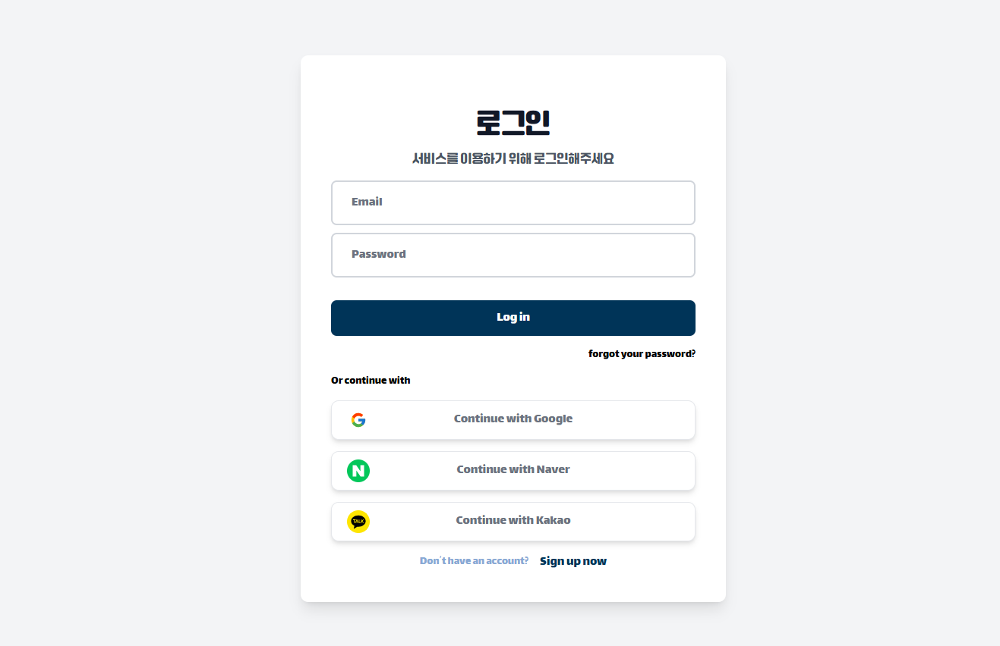
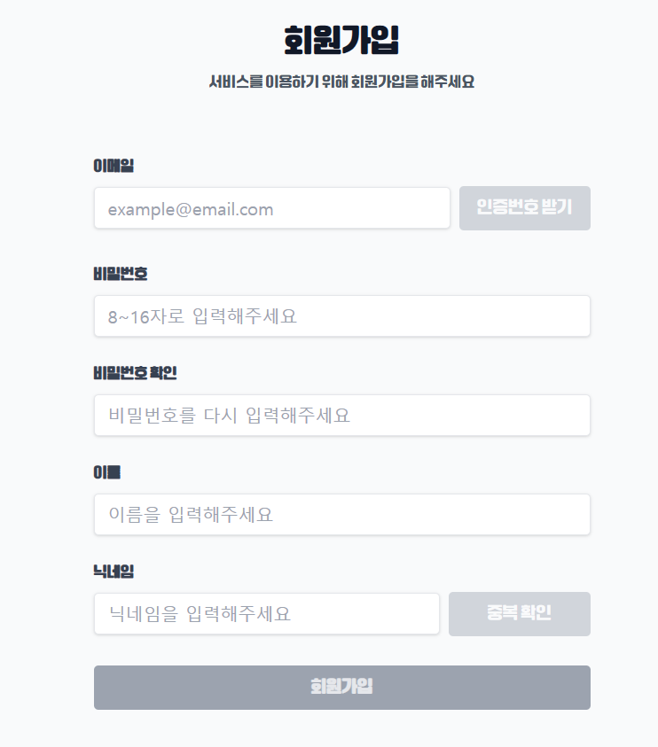
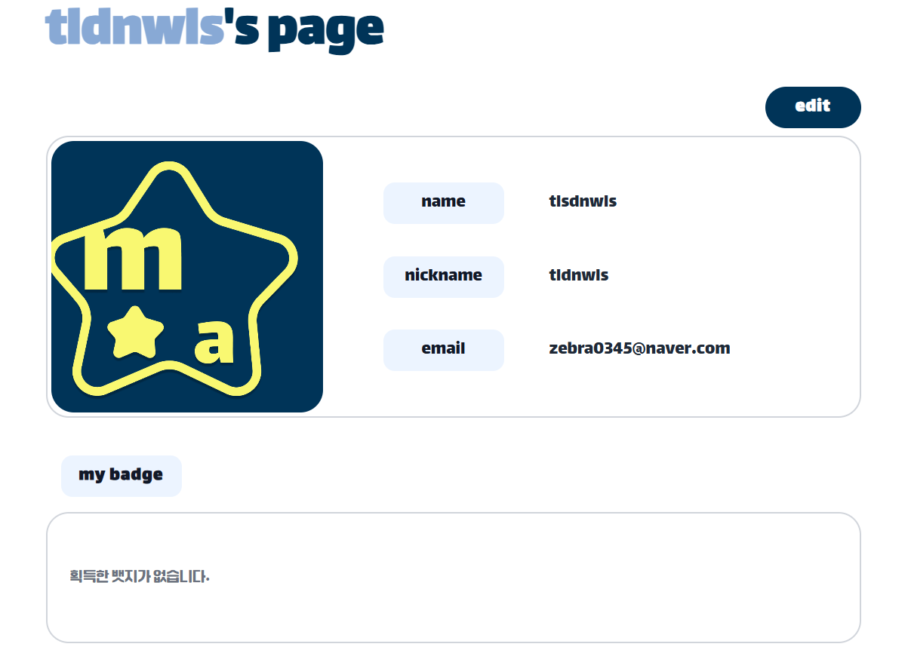
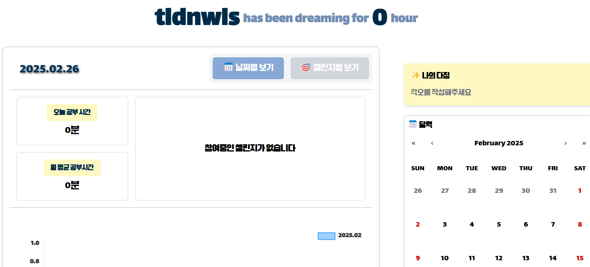
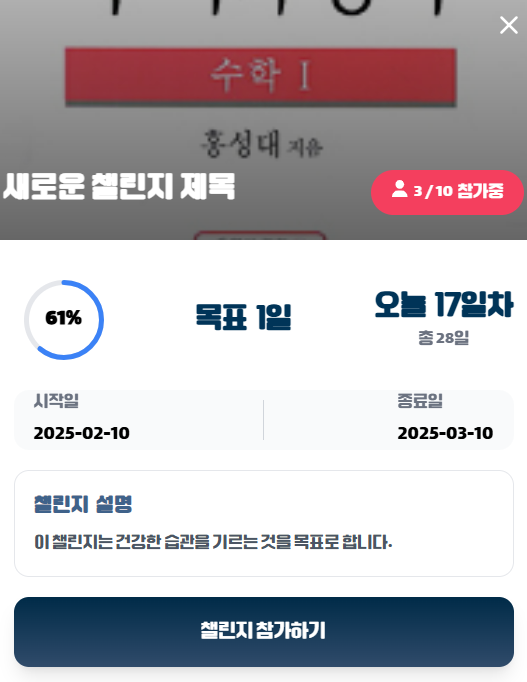
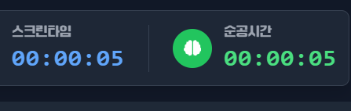
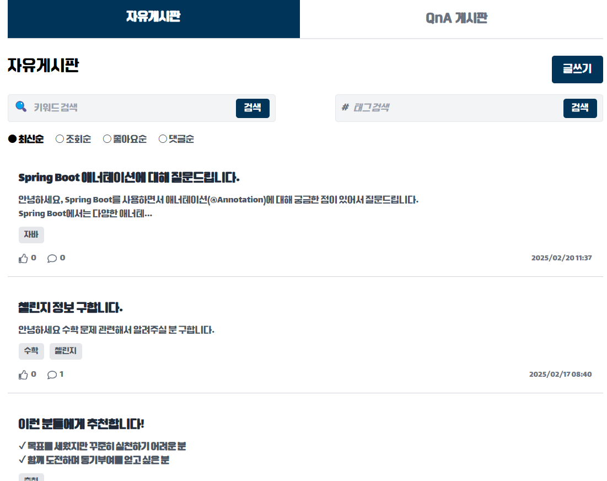

# 🌱 DreamMoA - 꿈모아 서비스

## 🌟 꿈모아 서비스 소개

**혼자서 이루기 힘든 공부 목표**, 함께라면 가능합니다! 🎯  
**꿈모아**는 WebRTC 기술을 활용하여 **실시간으로 공부 모임을 지원하는 서비스**입니다.  
이제 **꿈모아**와 함께 **더욱 효율적이고 즐겁게** 학습 목표를 달성해보세요! 📚✨

**꿈모아**는 다음과 같은 기능을 제공합니다:

- **실시간 화상 스터디**: WebRTC를 통해 **원활한 화상 통화**로 **언제 어디서나** 함께 공부할 수 있습니다. 🖥️🔗
- **공부 목표 설정 및 공유**: 개인별 목표를 설정하고 **모임 구성원들과 공유**하여 **동기부여를 높입니다**. 📝🤝
- **진행 상황 추적**: **실시간으로 학습 진행 상황을 확인**하고, **서로 피드백을 주고받을 수 있습니다**. 📊🔍
- **다양한 스터디 그룹 참여**: 관심 분야에 맞는 **다양한 스터디 그룹에 참여**하여 **지식을 넓히고 인맥을 쌓을 수 있습니다**. 🌐👥

**꿈모아**와 함께라면 **더 이상 혼자 고민하지 마세요**!  
**함께하는 학습**으로 **더 큰 성취감을 느껴보세요**. 🎓🌈

지금 바로 **꿈모아**에 가입하고, **새로운 학습 여정을 시작하세요**! 🚀

## 🌟 프로젝트 기간
2024.01.06 ~ 2024.02.14 (7주)

## 🌟 주요 기능

- **순공시간 측정**
  - **GRU 모델**을 기반으로 사용자 학습 태도를 분석하여 정확한 순공시간을 측정합니다.
  - 개인별 자세에 맞춘 학습 태도 체크 기능을 제공합니다.

- **온라인 스터디룸**
  - **WebRTC** 기반의 온라인 스터디룸을 통해 원활한 화상 스터디 환경을 제공합니다.
  - 태그 기능을 통해 같은 관심사를 가진 사용자들과 쉽게 스터디룸을 구성할 수 있습니다.

- **실시간 자막 기능**
  - **WebSocket**을 활용하여 실시간 자막을 제공합니다.
  - 자막의 정확도를 높이기 위해 중복 제거 및 필터링 기법을 사용합니다.

- **실시간 요약 기능**
  - **GPT API**를 통해 강의나 스터디룸의 대화를 실시간으로 요약하여 제공합니다.

- **대시보드**
  - 온라인 알림장을 작성하여 반 학부모들에게 효율적으로 전달할 수 있습니다.

- **게시판**
  - **Elasticsearch**와 의미 기반 검색 추천 기능 등 AI 기술을 도입한 게시판을 제공합니다.

- **뱃지 기능**
  - 완료한 챌린지별로 뱃지를 수여하여 수집의 즐거움을 제공합니다.

## 🌟 기술 스택

### **Backend - Spring**

  

  

  

### **Backend - FastAPI**

### **Frontend**

  

  

### **CI/CD**

### **Communication**

-FCA121?style=for-the-badge&logo=GitLab&logoColor=white)

## 🌟 팀원 소개
|  |  |  |  |  |  |
|---------------------------------------------------------------------------------------------------------------|----------------------------------------------------------------------------------------------------|---------------------------------------------------------------------------------------------------------------|-------------------------------------------------------------------------------------------------|--------------------------------------------------------------------------------------------------|--------------------------------------------------------------------------------------------------|
| 최은창([@cod0216](https://github.com/cod0216)) | 신우진([@zebra0345](https://github.com/zebra0345)) | 김소연([@SSO-RECORD](https://github.com/SSO-RECORD)) | 김한주 ([@oneweeeek](https://github.com/oneweeeek)) | 임남기([@namgi2386](https://github.com/namgi2386)) | 권남희([@naemhui](https://github.com/naemhui)) |
| Leader / Back End | Full Stack / AI | Full Stack | Back End / Deploy | Front End | Front End |

## 🌟 협업 방식

- Git
  - 브랜치 전략 : FE - BE 분리 후 각각 작업하여 develope에 push / MR 보내며 코드리뷰 요청
  - MR시, 팀원이 코드리뷰를 진행하고 피드백 게시

- JIRA
  - 각 업무들을 상위 - 하위 작업으로 쪼개어 상위 작업을 BE - FE로 분리
  - 하위 작업들을 각각 개인에게 할당

- 회의
  - 매일 아침 스크럼을 통해 문제상황 공유
  - 일과 종료 후 스크럼으로 진행사항 공유

- Notion
  - 회의록 기록하여 보관
  - 컨벤션, 트러블 슈팅, 개발 산출물 관리

## 🌟 화면 구성

### 로그인 화면

### 회원가입
- 기본 로그인 / 소셜로그인 제공
- 회원가입 시 이메일 인증과 비밀번호 유효성 검사

---
### 대시보드 - 마이페이지
- 완료한 스터디 확인
- 이름, 닉네임, 이메일 확인

### 대시보드 - 스터디 일정 확인
- 스터디 일정 및 참여 확인

### 스터디룸 - 태그 기능
- 태그로 공통의 관심사 확인

### 스터디룸룸 - 진행중인 스터디 확인
- 현재 진행중인 스터디 확인

### 스터디룸 - 상세보기
- 스터디의 정보와 진행상황 보기

### 스터디룸 - 순공시간분석
- 사용자 객체탐지를 기반으로 모델에서 학습태도 분석
- 결과값을 기반으로 타이머를 제어

### 스터디룸 - 자막 기능
- 말하는 내용 자동으로 자막 제공
- 자막 ON/OFF 로 사용자가 조절가능한 토글 제공
- GPT API 로 전체 자막을 요약할 수 있는 기능 제공

### 게시판
- 태그기반 / 키워드 기반 검색 지원
- 엘라스틱 서치 기반 효율적인 로직 사용
- 의미 기반 / 키워드 기반 유사 추천 로직 제공

